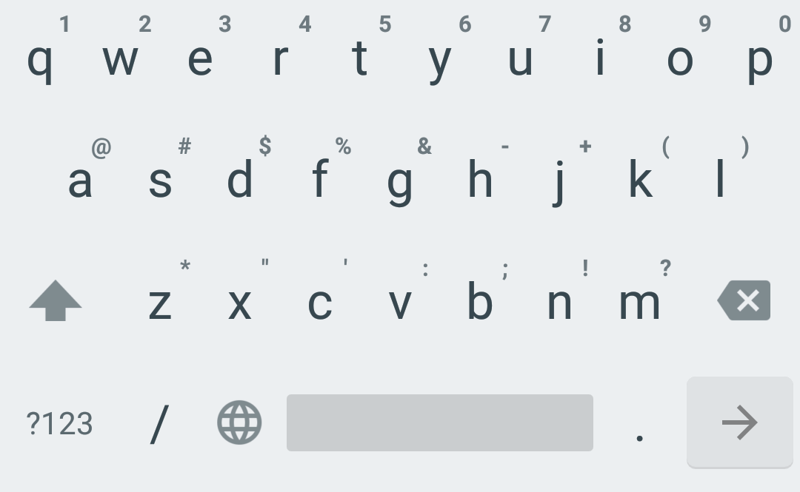

# Simple Keyboard

      
## About

Features:
- Small size (<1MB)
- Adjustable keyboard height for more screen space
- Number row
- Swipe space to move pointer
- Delete swipe
- Custom theme colors
- No INTERNET permission; optional account-based email suggestions request GET_ACCOUNTS
- Ads-free

Additional features in this fork:
- Emoji picker and emoji suggestions
- Local word completion and contextual suggestions
- Local learning controls in Preferences
- Optional reversible autocorrection on Space (off by default)
- Recent paste history: long press the clipboard button; stored in memory only
- Paste clipboard images into editors that advertise image support on Android 7.1+
- System image picker for compatible editors, without broad media-storage permission
- Voice typing through the device's speech-recognition provider
- English, Modern Standard Arabic, and expanded Egyptian Arabic bootstrap vocabulary
- Mixed Arabic/Latin ranking, bounded typo matching, and locally learned words
- One-handed left/right layouts plus a centered compact floating mode

Gesture word input and sticker/GIF insertion are intentionally deferred. A full desktop-class spell-checker is not yet implemented.

## Downloads

## Credits

Licensed under Apache License Version 2

This keyboard is based on AOSP LatinIME keyboard. You can get the original source code in https://android.googlesource.com/platform/packages/inputmethods/LatinIME/
